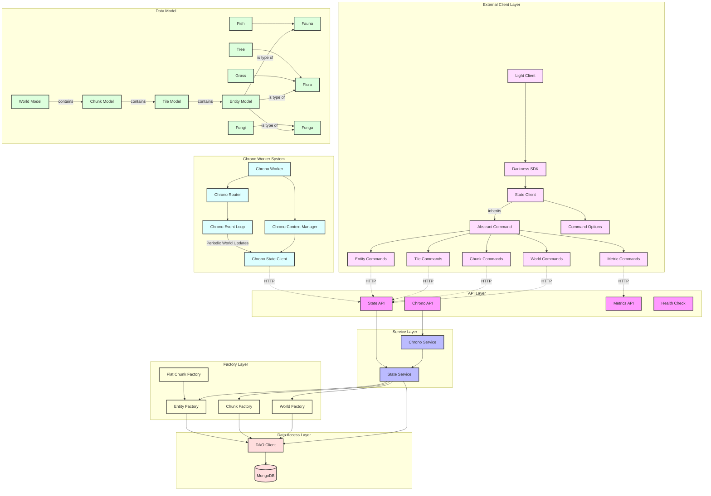

# Darkness Game Engine

## Overview
Darkness is a tile-based game engine that provides procedural world generation, entity lifecycle management, and realtime state processing. The system consists of a server-side component (Darkness) with MongoDB persistence and background state processing (Chrono), paired with a client visualization tool (Light). Together, these components form a complete engine for generating and managing dynamic tile-based worlds with automated lifecycle updates and real-time visualization of world state.
## Key Features

### World Generation
- Procedural world and terrain generation
- Chunked world management
- Tile-based environment system
- Entity lifecycle management

### Environment Types
- Ocean tiles with varying depths
- Land masses with varied terrain
- Shore and transition zones
- Forest and vegetation areas

### Entity System
- Flora: Trees, Grass
- Fauna: Fish
- Funga: Fungi
- Entity lifecycle states
- Automatic entity propagation

### State Management
- Real-time state updates
- Chunk quantum processing
- Entity lifecycle progression
- State persistence

## Architecture




### Major Components

#### Darkness Server
- FastAPI-based REST API
- MongoDB persistence layer
- Factory system for object creation
- Service layer for business logic
- Background processing system

#### Light Client
- Pygame-based visualization
- Real-time state updates
- Tile rendering system
- Entity visualization
- User interaction handling

#### Chrono Worker
- Background state processing
- Entity lifecycle management
- World state updates
- Quantum processing system

## Requirements

### Server Requirements
- Python 3.12 or higher
- MongoDB 7.0 or higher
- FastAPI
- uvicorn
- pymongo
- pydantic

### Client Requirements
- Python 3.12 or higher
- Pygame
- pydantic
- requests

### Platform Support
- Linux
- macOS
- Windows

## Installation

### Server Installation
```bash
python3 -m venv venv
source venv/bin/activate
pip install shapeandshare.darkness
```

### Client Installation
```bash
python3 -m venv venv
source venv/bin/activate
pip install shapeandshare.light
```

## Setup

### MongoDB Setup
```bash
# For macOS with MongoDB Version 7.0.14
curl https://fastdl.mongodb.org/osx/mongodb-macos-arm64-7.0.14.tgz -o mongodb.tgz
tar xfvz mongodb.tgz
mkdir -p data
```

### Environment Variables
```bash
# Server
export DARKNESS_MONGODB_HOST="localhost"
export DARKNESS_MONGODB_PORT="27017"
export DARKNESS_MONGODB_DATABASE="darkness"

# Client
export DARKNESS_TLD="localhost:8000"
export DARKNESS_SERVICE_SLEEP_TIME="1.0"
export DARKNESS_SERVICE_TIMEOUT="5.0"
export DARKNESS_SERVICE_RETRY_COUNT="5"

# Chrono Worker
export DARKNESS_WORKER_CHRONO_SLEEP_TIME="10"
```

## Running the System

### Using Local Infrastructure Scripts
The system provides scripts in `infra/local` for managing all components:

```bash
# Initial setup and startup of all components
infra/local/startup.sh

# Individual component management:
# MongoDB setup and start
infra/local/01_mongodb_setup.sh
infra/local/03_mongodb_run.sh

# State service setup and start
infra/local/02_state_setup.sh
infra/local/04_state_run.sh

# Chrono worker start
infra/local/05_chrono_run.sh

# System shutdown
infra/local/shutdown.sh
```

### Component Status
Check running components:
```bash
screen -ls
```

Expected output:
```
There are screens on:
        12345.darkness-mongodb     (Detached)
        12346.darkness-state       (Detached)
        12347.darkness-chrono      (Detached)
```

### Screen Session Management
Attach to a component screen:
```bash
screen -r darkness-state    # Attach to state service
screen -r darkness-mongodb  # Attach to MongoDB
screen -r darkness-chrono   # Attach to chrono worker
```

Detach from a screen session: Press `Ctrl+A` followed by `D`

### Starting Light Client
With the Darkness infrastructure running:
```bash
light
```
